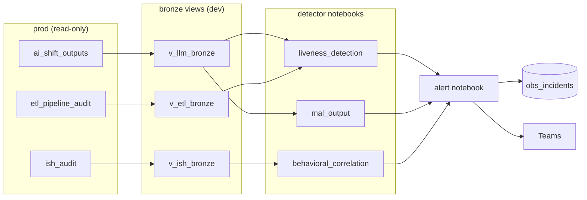

# PToF Agent Observability

Monitoring and alerting for the SAA/ISH shift-handover agent pipeline. Watches the agent's
outputs, the ISH handover-email system, and the upstream ETL feeding both — and pages Teams when
any of them silently breaks.

The core problem this solves: an LLM agent that stops working, or starts producing empty/garbled
output, or is quietly running on stale data, doesn't throw an exception. It just keeps running.
This pipeline exists to notice anyway.

## How it works

1. **Bronze projection** copies three raw production tables into durable, aliased views so every
   detector reads a stable schema instead of the raw source tables.
2. **Detector notebooks** run in parallel every ~5–10 minutes, each checking a different failure
   mode: is the agent still calling in on schedule, is its output well-formed, did the shift
   handover email actually send, is the upstream ETL keeping the data fresh.
3. **The alert notebook** collects every detector's findings, dedupes them against
   `obs_incidents` (so a still-ongoing problem is one incident, not one per cycle), auto-resolves
   incidents that stop recurring, and posts to Teams.

A separate nightly job rebuilds statistical baselines (normal ETL run duration, normal output
schema shape) that several detectors compare against.

## What gets watched

16 detectors across four areas, all evidence-driven — every threshold in this repo is backed by a
real historical query, documented in `threshold_basis`, not a guess:

- **Agent liveness** — has each capability (saa-display, situational-awareness, sev2-insights,
  summary) called in within its expected window; is the pipeline itself still running at all.
- **Output quality** — blank/empty outputs, missing fields versus the agent's normal output
  schema, missing shift context.
- **Handover delivery** — did the shift handover email actually send, and is the 7-day failure
  rate within norms.
- **Upstream ETL health** — per-table staleness, failed runs, abnormally slow runs, row counts
  crossing a table's historical zero/nonzero pattern.

Detectors that fan out into many simultaneous incidents from one root cause (e.g. an ETL outage
hitting a dozen tables at once) are batched into a once-daily digest instead of paging separately
for each one.

## Repo layout

| Notebook | Role |
|---|---|
| `ptof_obs_bronze_projection.ipynb` | Projects prod source tables into stable dev views |
| `ptof_obs_liveness_detection.ipynb` | Agent/ETL silence, staleness, and slow-run detectors |
| `ptof_obs_mal_output.ipynb` | Blank-output and schema-drift detectors |
| `ptof_obs_behavioral_correlation.ipynb` | Handover email delivery detectors |
| `ptof_obs_nightly_baseline.ipynb` | Nightly statistical baselines (run duration, output schema) |
| `ptof_obs_alert.ipynb` | Dedup, persistence, auto-resolve, and Teams alerting |
| `ptof_obs_setup_seed.ipynb` | One-time/manual setup: capability registry, threshold rationale, table DDL |

Two Databricks jobs run this: `obs_fresh_scan` (bronze → detectors → alert, every ~5–10 min) and
`obs_nightly_baseline` (baselines only, nightly).

## Design principles

- **Read prod, write dev.** No write access to the production catalog — every detector reads
  prod source tables through a read-only bronze view and persists findings only in the dev
  workspace.
- **Nothing is promoted without evidence.** Every active threshold cites the historical query
  that justified it, kept alongside the code in `threshold_basis`.
- **A dead detector is worse than a noisy one.** Job status reflects whether monitoring itself is
  healthy, not whether a finding occurred — a broken query fails the job; a real incident never
  does.
- **One incident, not one alert per cycle.** Ongoing conditions are deduped and only re-notify if
  left unacknowledged.

For the full technical reference — exact SQL, every threshold's derivation, and worked incident
walkthroughs — see `CLAUDE_DOC_BRIEF.md` alongside the notebooks it's written to accompany.
